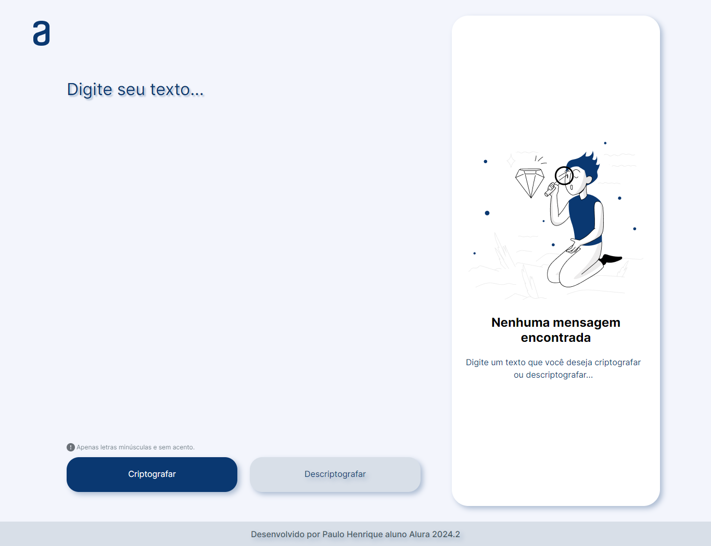
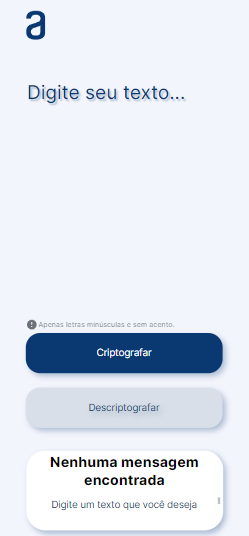

# Decodificador de Texto

Este é um projeto de decodificador de texto que permite criptografar e descriptografar mensagens. Ele foi desenvolvido utilizando HTML, CSS e JavaScript e está hospedado no Vercel.

## Funcionalidades

- **Criptografia de texto**: Converta mensagens legíveis em texto cifrado.
- **Descriptografia de texto**: Converta mensagens cifradas de volta para o texto legível.
- **Responsividade**: Interface adaptável para diferentes tamanhos de tela.

## Demonstração

Você pode acessar a aplicação hospedada no Vercel através do seguinte link: https://decodificador-de-texto0-1.vercel.app/

## Como Usar

1. **Criptografar**:
    - Digite a mensagem que deseja criptografar na caixa de texto.
    - Clique no botão "Criptografar".
    - O texto cifrado aparecerá na área de saída.

2. **Descriptografar**:
    - Digite a mensagem cifrada na caixa de texto.
    - Clique no botão "Descriptografar".
    - O texto legível aparecerá na área de saída.

## Capturas de Tela

### Interface Principal

  
  

### Exemplo de Criptografia

## Tecnologias Utilizadas

- HTML
- CSS
- JavaScript

## Estrutura do Projeto

